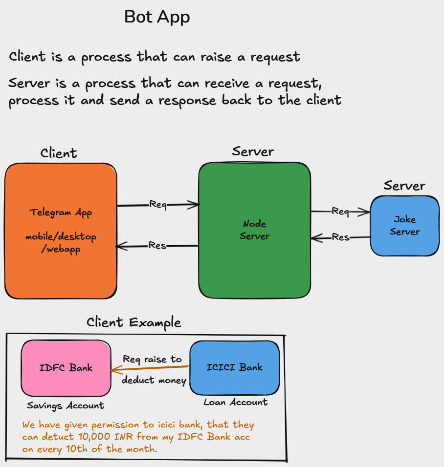

# Joke Bot 


## node telegram bot api
[Click here](https://www.npmjs.com/package/node-telegram-bot-api)
``` Bash
npm i node-telegram-bot-api
```

### BOT API set to environment variable
1. set manually environment variable in your system
2. download dotenv package to set environment variable for every session automatically
   ``` Bash
   npm i dotenv
   ```
   ``` JavaScript
   const dotenv = require('dotenv');
   dotenv.config();
   console.log(process.env.TELEGRAM_TOKEN);
   ```
3. You don't need to config if you have 20 or above node version
   ``` Bash
   node --env-file .env index.js
   ```

## Fetch joks from third party api
[Jokes](https://official-joke-api.appspot.com/random_joke)

## HTTP Request 
To HTTP or Network request, we use AXIOS library
``` Bash
npm i axios
```
