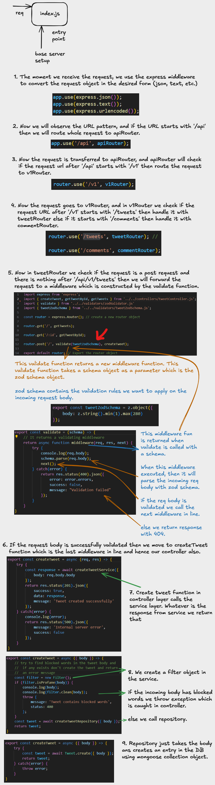

## Library used
1. zod
   ``` Bash
   npm i zod
   ```
2. multer
   By default, Multer does store the uploaded files on the server. If you want to store the files on a cloud storage service like AWS S3 or cloudinary, you can use the Multer-S3 package or Multer Storage Cloudinary. 
   ``` Bash
   npm i multer
   ```
3. Multer Storage Cloudinary
   ``` Bash
   npm i multer-storage-cloudinary
   ```
4. Cloudinary 
   ``` Bash
   npm install cloudinary
   ```

TypeScript-first schema validation with static type inference

