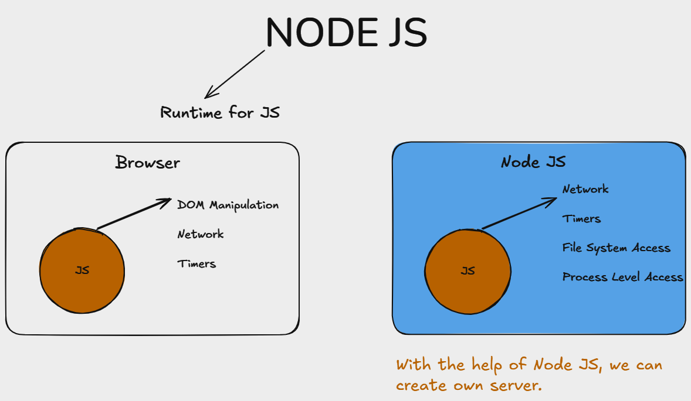
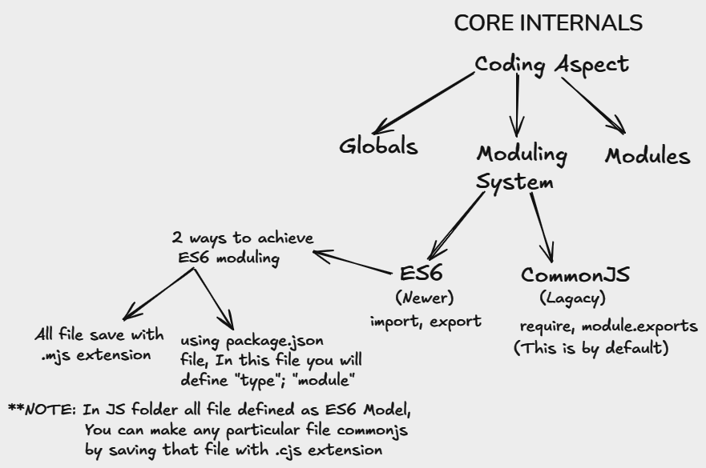

# NodeJS - Runtime Environment for JS
* Node JS is a free, open source, cross-plateform JavaScript runtime environment that lets developers create servers, web apps, command line tools and scripts.


## REPL Console


## NPM
* npm is the package manager for JavaScript. It is the default package manager for the JavaScript runtime environment.


## Core Aspects


# V8 Engine


Note: Convert JS code into bytecode - search on google

## File System
* Node.js has a built-in file system module that allows you to interact with the file system.
* The file system module provides a way to read and write files, as well as create and delete.

### templating engine
* templating engine is a software component that separates presentation logic from application logic.
* it is used to generate dynamic web pages.
#### use case
1. generate dynamic web pages with data from a database.
2. server-side rendering

## Rendering
Two type of rendering - 
1. client-side rendering
2. server-side rendering: performance will be low for example: let assume you make todo app with server side rendering, you submit the data and refreshing the page then you will see new updated page.

## cron
cron is a robust tool for running jobs (functions or commands) on schedules defined using the cron syntax.
Perfect for tasks like data backups, notifications, and many more!
``` Bash
npm i cron
```
You can create a project - you server will send a motivational quote daily by mail to registered user by fixed time. 

## Networking / Server