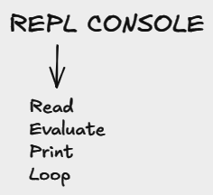
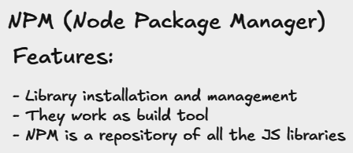
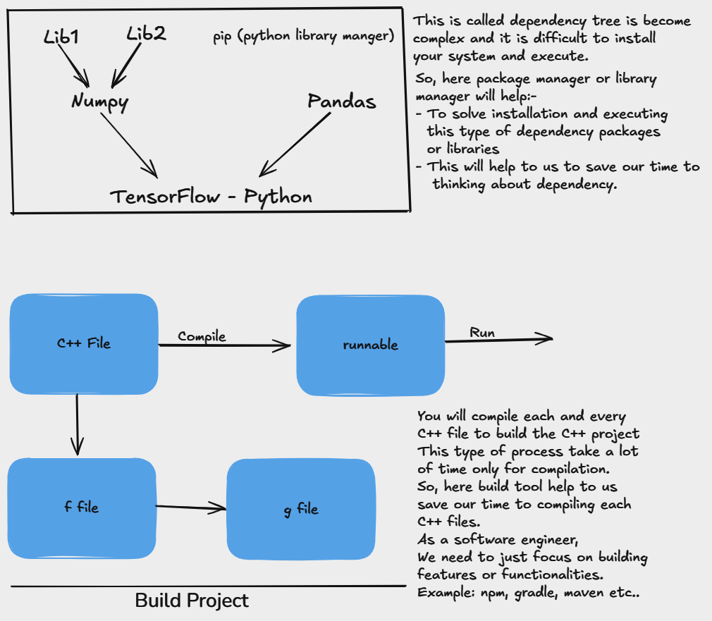
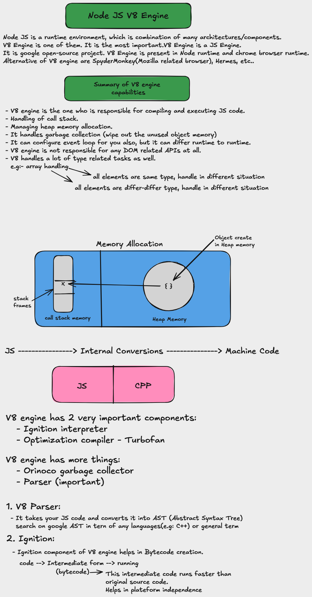

# NodeJS - Runtime Environment for JS
* Node JS is a free, open source, cross-plateform JavaScript runtime environment that lets developers create servers, web apps, command line tools and scripts.


## REPL Console


## NPM
* npm is the package manager for JavaScript. It is the default package manager for the JavaScript runtime environment.



## Core Aspects


# V8 Engine



Note: Convert JS code into bytecode - search on google

## File System
* Node.js has a built-in file system module that allows you to interact with the file system.
* The file system module provides a way to read and write files, as well as create and delete.

### templating engine
* templating engine is a software component that separates presentation logic from application logic.
* it is used to generate dynamic web pages.
#### use case
1. generate dynamic web pages with data from a database.
2. server-side rendering

## Rendering
Two type of rendering - 
1. client-side rendering
2. server-side rendering: performance will be low for example: let assume you make todo app with server side rendering, you submit the data and refreshing the page then you will see new updated page.

## cron
cron is a robust tool for running jobs (functions or commands) on schedules defined using the cron syntax.
Perfect for tasks like data backups, notifications, and many more!
``` Bash
npm i cron
```
You can create a project - you server will send a motivational quote daily by mail to registered user by fixed time. 

## Networking / Server

## REST APIs

[REST APIs - Microsoft](https://learn.microsoft.com/en-us/azure/architecture/best-practices/api-design)

## Backend Architecture (MVC)
MVC stands for model-view-controller. Here's what each of those components mean:
1. Model: The backend that contains all the data logic
2. View: The frontend or graphical user interface (GUI)
3. Controller: The brains of the application that controls how data is displayed

* Today the MVC pattern is used for modern web applications because it allows the application to be scalable, maintainable, and easy to expand.
* The MVC pattern helps you break up the frontend and backend code into separate components. This way, it's much easier to manage and make changes to either side without them interfering with each other.
* But this is easier said than done, especially when several developers need to update, modify, or debug a full-blown application simultaneously.

Note: Segrigation and separation are different

# NodeJS Streams
Node.js streams are a powerful way to handle asynchronous I/O operations efficiently. They allow you to read or write data in chunks, which is useful when working with large files, network requests, or any scenario where you don’t want to load everything into memory at once.

### Types of Streams in Node.js:
1. Readable Streams: For reading data (e.g., fs.createReadStream()).
2. Writable Streams: For writing data (e.g., fs.createWriteStream()).
3. Duplex Streams: Both readable and writable (e.g., sockets).
4. Transform Streams: A type of Duplex stream that can modify or transform the data as it is written and read (e.g., zlib.createGzip()).

### Key Concepts:
* Chunk: Data is read or written in small pieces called chunks.
* Buffering: Data is stored temporarily in memory before being processed.
* Backpressure: A situation where the data source is producing data faster than the destination can consume it. Node.js streams handle backpressure automatically.

#### Note: process.stdout.write() 
It is used to print something on console similar to console.log() but here is one difference is It does not print new line by default
```
process.stdout.write("hi"); 
process.stdout.write("Hello");
```

## JSON Web Token
### 📌 What is JWT?
A JWT (JSON Web Token) is a compact, URL-safe token format used to securely transmit information between parties as a JSON object. It is commonly used for authentication and authorization in web applications.

### ⚙️ JWT Structure
* A JWT consists of three parts, separated by dots (.):

```
HEADER.PAYLOAD.SIGNATURE
```
Each part is, <strong>Base64URL encoded:</strong>

<strong>Header :</strong>

``` json
{
  "alg": "HS256",
  "typ": "JWT"
}
```
* <strong>alg:</strong> Signing algorithm (e.g., HS256)

* <strong>typ:</strong> Token type (JWT)

<strong>Payload : </strong>

Contains the claims (data), e.g., user ID, email, role

Example:
``` json
{
  "id": 123,
  "role": "admin",
  "exp": 1714747021
}
```

<strong>Signature :</strong>

* Used to verify the token wasn’t changed

* Created using:
``` scss
scss
HMACSHA256(Base64UrlEncode(header) + "." + Base64UrlEncode(payload), secret)
```

### 🔐 Why Use JWT?
#### ✅ Authentication
* After login, the server issues a token to the client.

* The client sends the token in every request header (e.g., Authorization: Bearer <<token>token>).

* The server verifies the token and authenticates the user.

#### ✅ Authorization
* Encoded payload includes user roles or permissions.

* Backend uses the data to allow/deny access to specific routes.

#### ✅ Stateless Sessions
* No need for server-side session storage.

* All user info is inside the token and verified on each request.

#### ✅ Secure Information Exchange
* JWTs are signed (and optionally encrypted), ensuring data integrity.

* Useful for microservices, APIs, or mobile-to-server communication.

### 📤 How is JWT Created?
``` js
import jwt from 'jsonwebtoken';

const payload = { id: 1, role: 'admin' };
const token = jwt.sign(payload, 'your-secret-key', { expiresIn: '1h' });

console.log(token); // eyJhbGciOi...
```
### 📥 How is JWT Verified?
``` js
const decoded = jwt.verify(token, 'your-secret-key');
console.log(decoded); // { id: 1, role: 'admin', iat: ..., exp: ... }
```
### 🔧 How to Access JWT in Express.js?

#### From Authorization header (standard):

``` js
const authHeader = req.headers['authorization'];
const token = authHeader && authHeader.split(' ')[1];
From custom header (x-access-token):
```
```js
const token = req.headers['x-access-token'];
From cookie:
```
``` js
const token = req.cookies['token'];
```
### ⚠️ Important Notes
* JWT is not encrypted – it is encoded and signed.

* Anyone can decode it, but only the server with the secret key can verify and trust it.

* Always set an exp (expiry) field to prevent abuse.

* Use https to protect tokens in transit.

### 💡 Common Use Cases
* User login in SPAs (React, Angular)

* Securing APIs in Node.js

* Mobile app authentication

* Microservices communication

* Single Sign-On (SSO)

### Three main ways to pass data through a URL in web dev:

### ✅ 1. Query Parameters (Most Common)
Format:
```
https://example.com/page?key1=value1&key2=value2
```
Example:
```
https://example.com/search?query=shoes&sort=price
```
* Used for filters, search, or optional parameters.

* Easily accessible in Node.js/Express: req.query.query, req.query.sort

### ✅ 2. URL Path Parameters (Route Params)
Format:
```
https://example.com/users/123
```
Example Route (Express):
```
app.get('/users/:id', (req, res) => {
  console.log(req.params.id); // 123
});
```
* Used for identifiers like user IDs, product IDs.

* Defined in route patterns using :param.

### ✅ 3. Hash Parameters (Client-Side Only)
Format:
```
https://example.com/page#section1
```
* Used to navigate to specific sections of a page (e.g., anchors).

* Accessible via JavaScript window.location.hash.

* Not sent to the server, only client-side.

#### 📝 Summary Table
| Method        | Format Example               | Use Case                          | Server-Accessible? |
| ------------- | ---------------------------- | --------------------------------- | ------------------ |
| Query Params  | `/search?q=books&sort=price` | Search, filters, pagination       | ✅ Yes              |
| Path Params   | `/users/123`                 | Resource identification (e.g. ID) | ✅ Yes              |
| Hash Fragment | `/page#section1`             | In-page navigation (anchors)      | ❌ No               |
